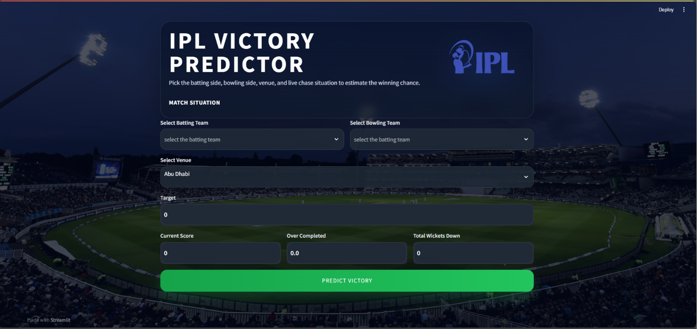

# IPL Win Probability Predictor

A Machine Learning based IPL match win probability prediction system developed using Python, Scikit-learn, Pandas, and Streamlit.

## Developed By
Shubham Kumar Gupta

## Project Overview
This project predicts the winning probability of IPL teams during live chase situations based on match conditions such as:

- Batting Team
- Bowling Team
- Venue
- Target Score
- Current Score
- Overs Completed
- Wickets Down

The prediction model is trained using historical IPL ball-by-ball datasets from 2008–2024.

---

## Features
- Real-time IPL win probability prediction
- Interactive Streamlit web interface
- Machine Learning based prediction
- Feature engineering using cricket match statistics
- Input validation for cricket overs
- Responsive modern UI

---

## Tech Stack
- Python
- Pandas
- NumPy
- Scikit-learn
- Streamlit
- Logistic Regression
- OneHotEncoder
- Machine Learning Pipeline

---

## Machine Learning Workflow
```text
Historical IPL Data
        ↓
Data Cleaning
        ↓
Feature Engineering
        ↓
One Hot Encoding
        ↓
Logistic Regression Model
        ↓
Probability Prediction
```

---

## Important Features Used
The model predicts probability using:
- Runs Left
- Balls Left
- Wickets Remaining
- Current Run Rate (CRR)
- Required Run Rate (RRR)
- Batting Team
- Bowling Team
- Venue

---

## Project Structure
```text
IPL-WIN-PROBABILITY-PREDICTOR
│
├── app.py
├── retrain_model.py
├── pipe.pkl
├── requirements.txt
├── README.md
├── matches_2008-2024.csv
├── deliveries_2008-2024.csv
└── ipl.ipynb
```

---

## How to Run the Project

### 1. Clone Repository
```bash
git clone https://github.com/Shubhamkumargupta9838/ipl-win-probability-predictor.git
```

### 2. Install Dependencies
```bash
pip install -r requirements.txt
```

### 3. Run Application
```bash
streamlit run app.py
```

---

## Model Details
The project uses:
- Scikit-learn Pipeline
- ColumnTransformer
- OneHotEncoder
- Logistic Regression Classifier

---

## Improvements Added
- Enhanced UI/UX
- IPL branding and responsive layout
- Robust input validation
- Updated IPL datasets (2008–2024)
- Modular training pipeline
- Better feature engineering

---

## Future Scope
- Live API integration
- Deep Learning models
- Cloud deployment
- Mobile application support
- Player-level analytics

---

## Screenshots



## License
This project is for educational and learning purposes.